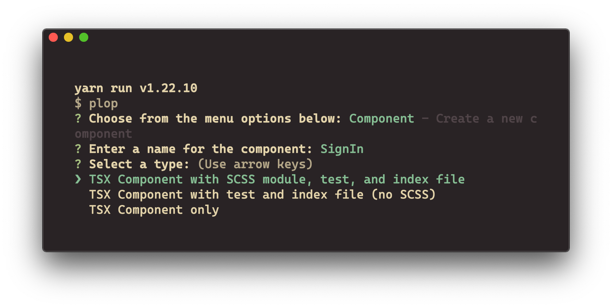
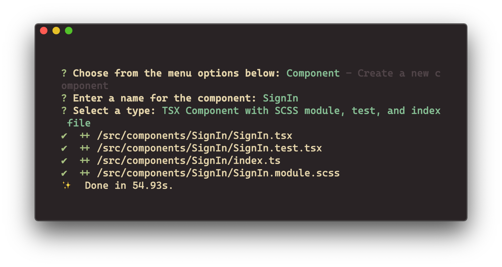

# 🧁 Baking Components and Pages with Plop.js

**Main Course** comes with a CLI code generator called [Plop](https://plopjs.com). You can use it to add new components, tests, pages, etc., based on the included [`.hbs`](https://handlebarsjs.com/guide/) templates—or ones you create yourself!

The included templates can generate:

- A new `tsx` component with `.test`, `.scss`, and `index.ts` files inside their own directory in `src/components`
- A new `tsx` component with `.test` and `index.ts` files (no SCSS) inside their own directory in `src/components`
- _Only_ a `.tsx` component inside its own directory in `src/components`
- A new page inside `src/pages`

Both components and pages created with `bake` include default Chakra UI elements.

## Getting Started

To create new components and pages, run `yarn bake` from the terminal.

### Example Component Generation

1. Choose `Component` from the menu, and enter a name (if none is provided, a randomized default will be generated)

1. Choose `TSX Component with SCSS module, test, and index file` from the menu

1. Plop will add a new subdirectory for the component and its related files

Follow the same initial steps to create a component, test file, and index, a standalone component, or a new page.

## Customize

The included templates are meant to help save you time by creating from defaults, but they can be customized to your liking.

To add your own custom templates and commands, edit the [`templates`](./templates) folder and [`plopfile.js`](./plopfile.js) (read [Plop’s documentation](https://plopjs.com/documentation/) for more advanced functionality). Plop uses [`Handlebars.js`](https://handlebarsjs.com/) for templating, which is easy to incorporate into your own templates. Variables to be passed to the templates are defined in the `plopfile`, and passed in handlebars' curly bracket syntax (e.g. `{{ variableName }}`).
